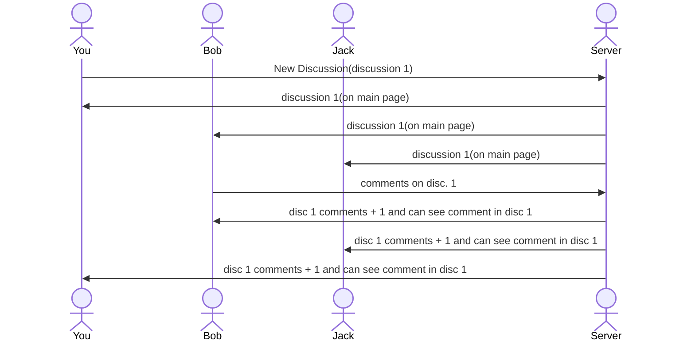

# Free Chat
[My Notes](notes.md)

Free Chat is an online discussion board where users can create and view discussions on various topics, from favorite restaraunts to best music. Users can create an account by adding their username on the main page. Users click on a discussion in the list to enter that discussion and can add their comments. Comment amounts are displayed next to each discussion so users can see how active their discussion is. The info tab will describe what the user can do on the main page and how to do them.

> [!NOTE]
>  This is a template for your startup application. You must modify this `README.md` file for each phase of your development. You only need to fill in the section for each deliverable when that deliverable is submitted in Canvas. Without completing the section for a deliverable, the TA will not know what to look for when grading your submission. Feel free to add additional information to each deliverable description, but make sure you at least have the list of rubric items and a description of what you did for each item.

> [!NOTE]
>  If you are not familiar with Markdown then you should review the [documentation](https://docs.github.com/en/get-started/writing-on-github/getting-started-with-writing-and-formatting-on-github/basic-writing-and-formatting-syntax) before continuing.

## 🚀 Specification Deliverable

> [!NOTE]
>  Fill in this sections as the submission artifact for this deliverable. You can refer to this [example](https://github.com/webprogramming260/startup-example/blob/main/README.md) for inspiration.

For this deliverable I did the following. I checked the box `[x]` and added a description for things I completed.

- [X] Proper use of Markdown
- [X] A concise and compelling elevator pitch
- [X] Description of key features
- [X] Description of how you will use each technology
- [X] One or more rough sketches of your application. Images must be embedded in this file using Markdown image references.

### Elevator pitch

Have you ever endlessly debated with your friends about different topics, or be discussion important things in a team meeting, only to run out of time and have to pause the discussion? The Free Chat application makes it so a group of people can pull out their phones, clearly see active discussions, and pick up wherre the discussion left off, as well as create many new discussions. As each user makes their discussions, they are automatically added and displayed in realtime to all the other app users. Once someone adds a comment, the total amoutn of that discussion's comments will be displayed on the main page. 

### Design

.jpeg)

### Diagram

Here is how a user would make a discussion and how making a comment would work with the backend of the app when commenting on a discussion. User makes new discussion, everyone else can see it, another comments in said discussion, that comment can be viewed by others and the number of that discussion's comments goes up.

### Key features

- Secure login over https
- Abity to select and create discussions
- Ability to comment in a discussion
- Display of made discussions and their total comments
- Display of comments within discussion sleected
- Comments and total comments displayed in real time
- discussions and comments persistently stored
- ability of users to edit and delete their comments
- ability of admin to delete discussions

### Technologies

I am going to use the required technologies in the following ways.

- **HTML** - Uses correct html structure for app. Two pages, one main for login and discussion choice/creation, and one for the discussion itself with the comments.
- **CSS** - Styling that looks simple yet good, good use of whitespce and contrast, easily readable layout of titles and interactable elements such as the creat tab and individual discussions.
- **React** - Provides login, discussion display and main page display, creating a new discussion, commenting, display other users comments and the individual comment total for each discussion, and use of React for routing and components.
- **Service** - Backend service with endpoints for:
login
retrieving discussions 
creating discussions
commenting
retrieving total comments for each discussion
Will use a third party news API to allow users to find the latest news topics as a way of finding discussion tpics for new chats
- **DB/Login** - Store users, discussions, and comments/comment totals in database. Register and login users. Credentials securely stored in database. Can't comment or create discussions unless authenticated.
- **WebSocket** -  As each user comments or creates discussions, their discussions are broadcast to all other users on the main page. As they comment, those comments are broadcast to everyone within the discussion while the total amount of that discussion's comments are updated and broadcast on the main page to every user.

## 🚀 AWS deliverable

For this deliverable I did the following. I checked the box `[x] Also completed each of the three steps, EC2, route53, and caddy instructions. Note: made my domain name before setting this up so the name doesnt exactly match the application function but it works since my app is still gonna be a discussion board type app. Made an elastic ip address as recommended, can ssh into my server, and edited the cadyy file as per the instructions.

- [X] **Server deployed and accessible with custom domain name** - [My server link](https://maxwhitneygamediscussion.click/).

## 🚀 HTML deliverable

For this deliverable I did the following. I checked the box `[x]` and added a description for things I completed.

- [X] **HTML pages** - 5 html pages for login, finding topics, making chats, seeing active chats, and an example chat.
- [X] **Proper HTML element usage** - Html structure fits example usages as is used correctly, such as headers, links, buttons, images, etc.
- [X] **Links** - Login submission links to making a chat page, includes links to other pages as well, other links link to resective pages.
- [X] **Text** - Descriptions for how to use make chat page, get topic page, and active chat page.
- [X] **3rd party API placeholder** - Placeholder in get topic page has example topic from api, and button to be used to generate topic from api(non functional atm).
- [X] **Images** - Added an image of the free chat logo(AI GENERATED) to the get topic page.
- [X] **Login placeholder** - Login placeholder on main page, links to make chat page on submission submission text box for username and password, with login and create buttons.
- [X] **DB data placeholder** - comment amounts, activity dates, and activity notifications pulled from database.
- [X] **WebSocket placeholder** - number of comments, notifications, comments in chats, and dates of recent activity represent realtime data.

## 🚀 CSS deliverable

For this deliverable I did the following. I checked the box `[x]` and added a description for things I completed.

- [X] **Header, footer, and main content body** - I added headers and footers for every page that all are the same for consistency. The main body content is unique for each page, including slight variations for background colors and designs.
- [X] **Navigation elements** - I made sure the navigation items were clear and underlined, amde sure they work as links and fit within the ehader correctly..
- [X] **Responsive to window resizing** - My app looks good on the screen and adjusts according to screen/window size until overidden if size is too small or too large for it to shrink down or spread out/fill the space, respectively.
- [X] **Application elements** - I made sure the elements if my application were clear to understand and each page was unique yet consitent to the overlall design Good contrast and use of space and use of containers.
- [X] **Application text content** - Consistent fonts and clear readability in each instance of text.
- [X] **Application images** - Updated image to match my app in the get topic page, adjusted it to fit in the center of the page and fit with the rest of the main content, and updated it to be the app icon in the browser tab.

## 🚀 React part 1: Routing deliverable

For this deliverable I did the following. I checked the box `[x]` and added a description for things I completed.

- [X] **Bundled using Vite** - Completed! App is bundled and set up with vite,
- [X] **Components** - Got each of my components set up using react and have them each linked together using react:
- login - got the login buttons to go to the make chat page with react
- make chat - make button goes to chat page
- active chats - clicking on the buttons for each active chat opens the chat page
- topic - set up the topic page correctly with react, button will link to third party news source later on
- chat - set up the look correctly in react, buttons will do their purposes later on
- [X] **Router** - Routing works between my components according to the buttons and links displayed, except for the non-functional buttons.

## 🚀 React part 2: Reactivity

For this deliverable I did the following. I checked the box `[x]` and added a description for things I completed.

- [X] **All functionality implemented or mocked out** - Using local storage for users when logged in for user display and accessibility to further pages when logged in. Mocked out third party application topic fetching. Added chat functionality so I can actually 'send' a message in a chat. Make chat stored made chats and puts them into the active chats table. Make chat also has mocked out notifications for chat updates/whenever other users make chats. Message count is saved for each chat in active chat page. Persistent storage of each chat's messages that are reflected in number of messages in active chats page. Login now makes you use put both a username and password in, otherwise it tells you to do so. Logging out redirects back to login page.
- [X] **Hooks** - Use of useState hooks in login, app and topic pages. Use of useState and useEffect in chat example page to do messages appearing in the chat box. Usestate and useeffect in both make chat and active chats for notifications for makechat and storage of created chats for both. using both hooks in chat for messages and staorage of messages, as well as users own inputed message. Overall extensive use of useState and useEffect.

## 🚀 Service deliverable

For this deliverable I did the following. I checked the box `[x]` and added a description for things I completed.

- [ ] **Node.js/Express HTTP service** - I did not complete this part of the deliverable.
- [ ] **Static middleware for frontend** - I did not complete this part of the deliverable.
- [ ] **Calls to third party endpoints** - I did not complete this part of the deliverable.
- [ ] **Backend service endpoints** - I did not complete this part of the deliverable.
- [ ] **Frontend calls service endpoints** - I did not complete this part of the deliverable.

## 🚀 DB/Login deliverable

For this deliverable I did the following. I checked the box `[x]` and added a description for things I completed.

- [ ] **User registration** - I did not complete this part of the deliverable.
- [ ] **User login and logout** - I did not complete this part of the deliverable.
- [ ] **Stores data in MongoDB** - I did not complete this part of the deliverable.
- [ ] **Stores credentials in MongoDB** - I did not complete this part of the deliverable.
- [ ] **Restricts functionality based on authentication** - I did not complete this part of the deliverable.

## 🚀 WebSocket deliverable

For this deliverable I did the following. I checked the box `[x]` and added a description for things I completed.

- [ ] **Backend listens for WebSocket connection** - I did not complete this part of the deliverable.
- [ ] **Frontend makes WebSocket connection** - I did not complete this part of the deliverable.
- [ ] **Data sent over WebSocket connection** - I did not complete this part of the deliverable.
- [ ] **WebSocket data displayed** - I did not complete this part of the deliverable.
- [ ] **Application is fully functional** - I did not complete this part of the deliverable.
